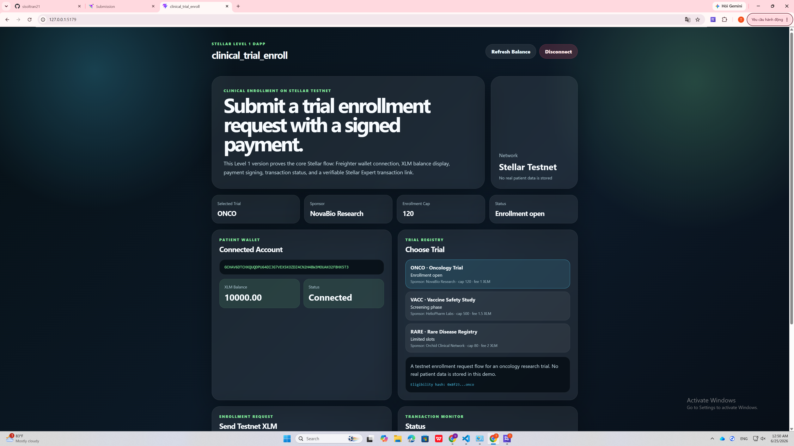
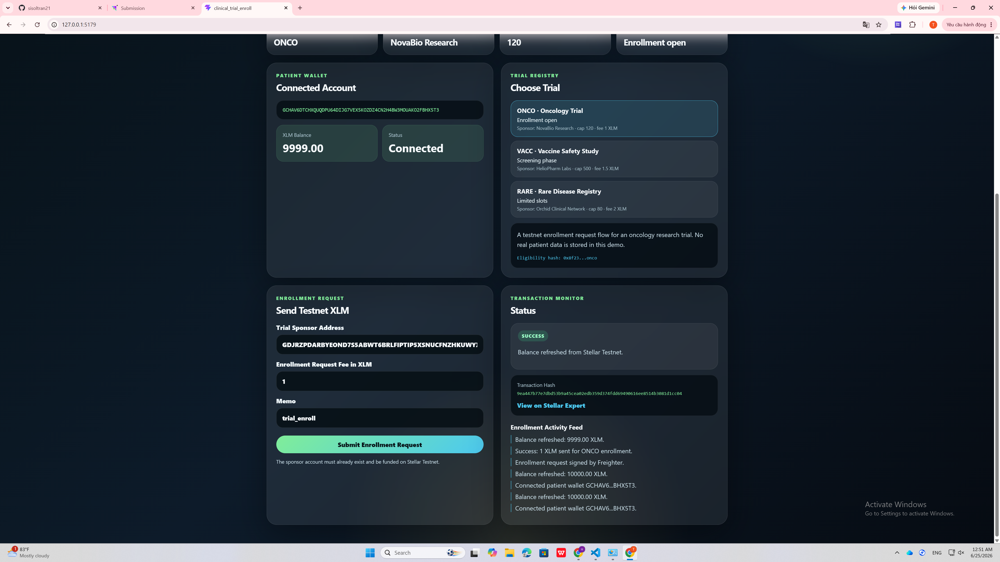

# clinical_trial_enroll

## Project Description

**clinical_trial_enroll** is a Stellar Testnet dApp for submitting a clinical trial enrollment request through a Freighter wallet.

Clinical trial enrollment often depends on fragmented forms, manual verification, sponsor-side databases, and opaque approval workflows. This Level 1 version of **clinical_trial_enroll** demonstrates the first on-chain step: a patient connects a Freighter wallet, checks their XLM balance, chooses a clinical trial, and sends a testnet XLM enrollment request transaction to a trial sponsor address.

This project is built for Stellar Level 1 and focuses on the core fundamentals: wallet connection, wallet disconnection, balance display, transaction signing, transaction status, and transaction hash visibility.

No real patient data is stored in this demo.

## Project Vision

The long-term vision of **clinical_trial_enroll** is to become a neutral on-chain coordination layer for clinical research.

In a future Soroban version, pharmaceutical sponsors will be able to publish a trial with hashed eligibility criteria and a hard enrollment cap. Patients will be able to submit consent-backed enrollment requests from their own wallets, and only the original sponsor will be able to verify and approve each request.

For Level 1, this project proves the foundation: a user can connect a Stellar wallet, view their XLM balance, and send a real transaction on Stellar Testnet.

## Built With

* Stellar Testnet
* Freighter Wallet
* Stellar SDK
* Freighter API
* React
* TypeScript
* Vite

## Level 1 Requirements Covered

| Requirement                          | Status    |
| ------------------------------------ | --------- |
| Set up Freighter wallet              | Completed |
| Use Stellar Testnet                  | Completed |
| Wallet connect functionality         | Completed |
| Wallet disconnect functionality      | Completed |
| Fetch connected wallet XLM balance   | Completed |
| Display balance clearly in UI        | Completed |
| Send XLM transaction on Testnet      | Completed |
| Show success or failure state        | Completed |
| Show transaction hash / confirmation | Completed |
| Public GitHub repository             | Completed |

## Transaction Proof

* **Network:** Stellar Testnet
* **Transaction Hash:** `9ea447b77e7dbd53b9a45cea02edb359d374fdd69490616ee8514b3081d1cc04`
* **Stellar Expert Link:** https://stellar.expert/explorer/testnet/tx/9ea447b77e7dbd53b9a45cea02edb359d374fdd69490616ee8514b3081d1cc04

## Screenshots

### Wallet Connected + Balance Displayed



### Successful Testnet Transaction



## How to Run Locally

### 1. Clone the repository

```bash
git clone https://github.com/sisoltran21/clinical_trial_enroll.git
cd clinical_trial_enroll
```

### 2. Install dependencies

```bash
npm install
```

### 3. Start the development server

```bash
npm run dev
```

For this project, using a unique local port is recommended:

```bash
npm run dev -- --host 127.0.0.1 --port 5179
```

Then open:

```bash
http://127.0.0.1:5179/
```

## How to Use

1. Install the Freighter wallet extension.
2. Switch Freighter to Stellar Testnet.
3. Fund your Testnet wallet.
4. Open the app locally.
5. Click **Connect Freighter**.
6. Confirm the connection in Freighter.
7. View your connected wallet address and XLM balance.
8. Choose a clinical trial such as `ONCO`, `VACC`, or `RARE`.
9. Enter a funded Stellar Testnet trial sponsor address.
10. Enter the enrollment request fee in XLM.
11. Click **Submit Enrollment Request**.
12. Approve the transaction in Freighter.
13. View the success message, transaction hash, and Stellar Expert link.

## Project Structure

```text
clinical_trial_enroll
├── screenshots
│   ├── wallet-balance.png
│   └── transaction-success.png
├── src
│   ├── App.css
│   ├── App.tsx
│   └── main.tsx
├── .gitignore
├── README.md
├── index.html
├── package.json
├── package-lock.json
├── tsconfig.json
├── tsconfig.app.json
├── tsconfig.node.json
└── vite.config.ts
```

## Notes

This is the Level 1 version of **clinical_trial_enroll**.

The current app does not use a Soroban smart contract yet. The Soroban contract version will be added in a future Level 2 version, where sponsors can publish trials, patients can submit enrollment requests, and sponsors can verify or approve those requests directly on-chain.
